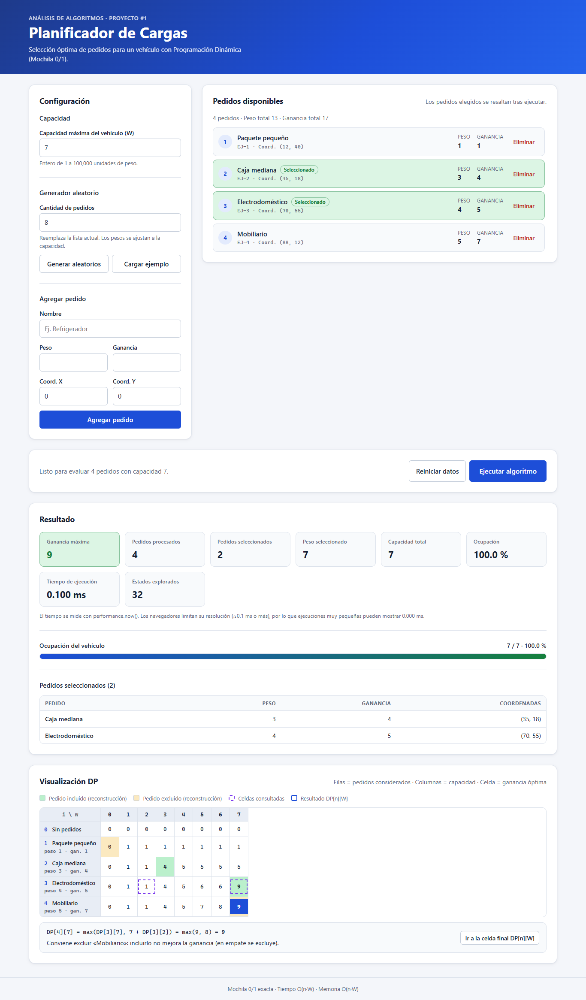
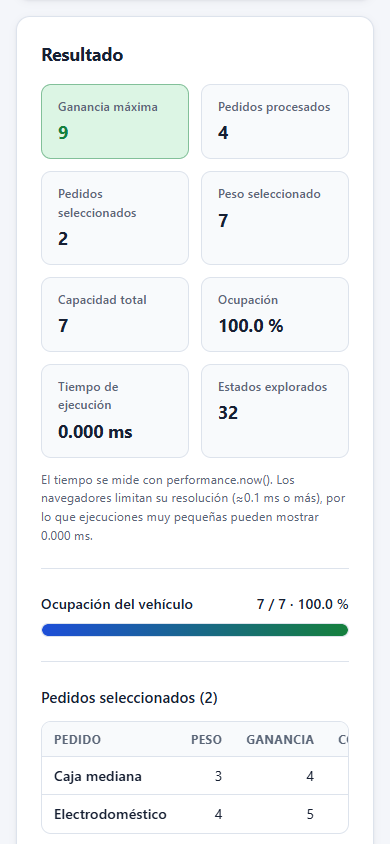

# Planificador de Cargas — Mochila 0/1 con Programación Dinámica

Proyecto #1 de **Análisis de Algoritmos**. Aplicación web en React que decide qué pedidos cargar en
un vehículo de capacidad limitada para **maximizar la ganancia**, resolviendo el problema de la
**Mochila 0/1 exacta** con **Programación Dinámica**. Además, muestra paso a paso la tabla de
estados.



## Descripción

Cada pedido tiene la forma:

```js
{ id, name, weight, profit, x, y }
```

El usuario configura la capacidad del vehículo, arma una lista de pedidos (manual, aleatoria o con
el ejemplo del enunciado) y ejecuta el algoritmo. La aplicación muestra:

- los pedidos seleccionados, resaltados en la lista y en una tabla de resumen;
- la ganancia máxima, el peso utilizado, la capacidad total y el porcentaje de ocupación;
- la cantidad de pedidos procesados y seleccionados;
- el tiempo de ejecución (`performance.now()`) y los estados DP explorados;
- la **tabla DP** (filas = pedidos, columnas = capacidades, celda = ganancia óptima), con el camino
  de reconstrucción resaltado y la explicación de cómo se calculó cada celda.

## Objetivo

Implementar y analizar un algoritmo exacto de Programación Dinámica para la planificación de
cargas, documentando su corrección, su complejidad pseudopolinomial `O(n·W)` y los trade-offs
entre exactitud y memoria, con una interfaz que haga visible el proceso.

## Tecnologías

| Tecnología  | Uso                                             |
| ----------- | ----------------------------------------------- |
| React 19    | Interfaz con componentes funcionales y Hooks    |
| Vite 5      | Servidor de desarrollo y build                  |
| JavaScript  | Sin TypeScript                                  |
| CSS         | Estilos propios con variables, responsive y modo oscuro |
| Vitest 2    | Pruebas unitarias                               |
| Git         | Control de versiones con Gitflow                |
| GitHub Pages| Despliegue mediante GitHub Actions              |

No se usan Redux ni librerías de UI: el estado vive en un único hook personalizado
(`useKnapsack`).

## Requisitos

- **Node.js** 18, 20 o superior (probado con Node 21.6 en local; la CI usa Node 22).
- **npm** 9 o superior.

## Instalación

```bash
npm install
```

## Ejecución local

```bash
npm run dev
```

Abre la URL que muestra Vite (por defecto `http://localhost:5173/`).

## Pruebas

```bash
npm test
```

Ejecuta 77 pruebas unitarias con Vitest: algoritmo, reconstrucción, métricas, validaciones,
generador aleatorio y modelo de la tabla. Entre ellas, 200 casos aleatorios con semilla fija se
contrastan contra un oráculo de fuerza bruta. `npm run test:watch` ejecuta las pruebas en modo
observación.

## Build

```bash
npm run build     # genera dist/
npm run preview   # sirve dist/ localmente con la misma ruta base que GitHub Pages
```

## Estructura

```text
proyecto-ruteo-cargas/
├── .github/workflows/
│   ├── ci.yml                    # pruebas + build en develop, feature/* y PRs
│   └── deploy.yml                # despliegue a GitHub Pages desde main
├── docs/
│   ├── algorithm.md              # explicación del algoritmo
│   ├── complexity.md             # análisis de complejidad
│   └── screenshots/
├── public/
│   └── favicon.svg
├── src/
│   ├── algorithms/dynamicProgramming/   # ALGORITMO (JavaScript puro, sin React)
│   │   ├── knapsackDP.js                #   construcción de la tabla y solveKnapsack
│   │   ├── reconstructSolution.js       #   reconstrucción de pedidos seleccionados
│   │   └── metrics.js                   #   tiempo, peso, ocupación, estados
│   ├── components/                      # UI
│   │   ├── common/FormField.jsx
│   │   ├── controls/ExecutionControls.jsx
│   │   ├── layout/{Header, MainLayout}.jsx
│   │   ├── orders/{OrderForm, OrderList, OrderCard, RandomOrderGenerator}.jsx
│   │   ├── results/ResultPanel.jsx
│   │   ├── statistics/StatisticsPanel.jsx
│   │   ├── vehicle/{CapacityInput, CapacityBar}.jsx
│   │   └── visualization/               # VISUALIZACIÓN
│   │       ├── DPTable.jsx, DPCell.jsx, DPCellDetails.jsx, DPTablePager.jsx
│   │       ├── SelectedOrders.jsx
│   │       └── dpTableModel.js          #   lógica pura de la vista (paginación, explicación)
│   ├── constants/config.js              # límites y valores por defecto
│   ├── hooks/useKnapsack.js             # ESTADO de la aplicación
│   ├── pages/HomePage.jsx               # composición de la página
│   ├── services/orderGenerator.js       # generador aleatorio desacoplado
│   ├── styles/{global, variables}.css
│   ├── utils/{validation, formatters}.js
│   ├── App.jsx
│   └── main.jsx
├── tests/                               # PRUEBAS
│   ├── algorithms/knapsackDP.test.js
│   ├── helpers/orders.js
│   ├── services/orderGenerator.test.js
│   ├── utils/validation.test.js
│   └── visualization/dpTableModel.test.js
├── index.html
├── package.json
└── vite.config.js
```

Además de las carpetas de la estructura propuesta, se añadieron `components/common`,
`components/controls` y `components/results` para que `HomePage` sea solo composición. También
se añadió `dpTableModel.js`, que separa la lógica de la vista de la tabla de su renderizado y
permite probarla sin navegador. Los estilos de cada grupo de componentes viven junto a ellos.

## Algoritmo (resumen)

Estado: `DP[i][w]` = ganancia máxima usando los primeros `i` pedidos con capacidad `w`.

```text
DP[0][w] = 0
DP[i][w] = DP[i − 1][w]                                              si weight[i−1] > w
DP[i][w] = max(DP[i − 1][w], profit[i−1] + DP[i − 1][w − weight[i−1]])   si cabe
```

La respuesta es `DP[n][W]`. Para reconstruir la selección se recorre la tabla desde `(n, W)`: si
`DP[i][w] ≠ DP[i−1][w]`, el pedido `i` se incluyó y se resta su peso. Los empates se resuelven
siempre excluyendo, por lo que el resultado es **determinista**.

```js
import { solveKnapsack } from './src/algorithms/dynamicProgramming/knapsackDP.js';

const { maxProfit, totalWeight, selectedOrders, dpTable, statesExplored, executionTime } =
  solveKnapsack(orders, capacity);
```

Detalle completo en [docs/algorithm.md](docs/algorithm.md).

## Complejidad

| Recurso | Costo    |
| ------- | -------- |
| Tiempo  | `O(n·W)` |
| Memoria | `O(n·W)` (se conserva la tabla completa para reconstruir y visualizar) |

Es **pseudopolinomial**: depende del *valor* numérico de `W`, que es exponencial respecto al
número de bits con que se escribe. Mejor, peor y caso esperado coinciden en `Θ(n·W)`, porque la
tabla siempre se llena completa. El análisis completo, las mediciones y la comparación con fuerza
bruta están en [docs/complexity.md](docs/complexity.md).

## Uso de la aplicación

1. **Capacidad**: ingresa la capacidad máxima del vehículo `W` (entero de 1 a 100 000).
2. **Pedidos**, de tres formas posibles:
   - *Agregar pedido*: nombre, peso (entero > 0), ganancia (> 0) y coordenadas X/Y.
   - *Generar aleatorios*: reemplaza la lista con N pedidos válidos (1–100), con pesos ajustados
     a la capacidad.
   - *Cargar ejemplo*: el caso del enunciado (pesos 1, 3, 4, 5; ganancias 1, 4, 5, 7; `W = 7`).
3. **Ejecutar algoritmo**: calcula la solución y desplaza la vista al resultado.
4. **Resultado**: estadísticas, barra de ocupación y tabla de pedidos seleccionados.
5. **Visualización DP**: haz clic en cualquier celda para ver su fórmula y las celdas de las que
   depende. *Ir a la celda final* salta a `DP[n][W]`. Las tablas grandes se recorren por bloques.
6. **Eliminar** pedidos individualmente o **Reiniciar datos** para empezar otro caso, sin recargar
   la página.

Cualquier cambio en los pedidos o en la capacidad invalida el resultado anterior, para no mostrar
datos desactualizados.

**Validaciones**: se rechazan nombres vacíos, `NaN`, `Infinity`, valores negativos o cero, pesos y
capacidades no enteros, y ejecuciones que requieran más de 5 000 000 estados DP (unos 40 MB). Los
errores se muestran junto al campo correspondiente o sobre el botón de ejecución.



## Gitflow

```text
main       ← versión estable (solo recibe Pull Requests desde develop)
 ↑
develop    ← integración
 ↑
feature/*  ← funcionalidades
```

| Rama        | Propósito                                            |
| ----------- | ---------------------------------------------------- |
| `main`      | Versión estable; es la que se despliega              |
| `develop`   | Integración de todas las funcionalidades             |
| `feature/*` | Una funcionalidad; nace de `develop` y vuelve a ella |

Flujo de trabajo:

```bash
git switch develop
git switch -c feature/nombre-funcionalidad
# ... cambios ...
git add .
git commit -m "feat: descripción"          # Conventional Commits
git push -u origin feature/nombre-funcionalidad
# Pull Request: feature/* → develop
# Cuando develop es estable: Pull Request develop → main
```

**No se realizan pushes directos a `main`.** `main` solo recibe cambios mediante Pull Request desde
`develop`. Se recomienda activar la protección de rama en GitHub (*Settings → Branches*) para
exigir Pull Request y que la CI pase.

Los commits siguen [Conventional Commits](https://www.conventionalcommits.org/): `feat:`, `fix:`,
`chore:`, `refactor:`, `test:`, `docs:`, `style:`.

## Despliegue (GitHub Pages)

El despliegue es automático mediante [`.github/workflows/deploy.yml`](.github/workflows/deploy.yml)
cada vez que `main` recibe cambios (es decir, al fusionar el Pull Request `develop → main`). El
workflow instala dependencias, ejecuta las pruebas, genera el build y lo publica.

Configuración única en GitHub:

1. Crear el repositorio y añadir el remoto: `git remote add origin <URL>`.
2. En *Settings → Pages*, elegir **Source: GitHub Actions**.

**Ruta base.** GitHub Pages sirve el sitio en `https://<usuario>.github.io/<repositorio>/`:

- En GitHub Actions, la base se calcula automáticamente a partir del nombre del repositorio
  (variable `BASE_PATH`).
- Para builds locales, la base por defecto es `/proyecto-ruteo-cargas/`. Si el repositorio se
  llama distinto, cambia `REPOSITORY_NAME` en [`vite.config.js`](vite.config.js) o define
  `BASE_PATH`:

  ```bash
  BASE_PATH=/otro-nombre/ npm run build
  ```

En desarrollo (`npm run dev`) la base siempre es `/`.
